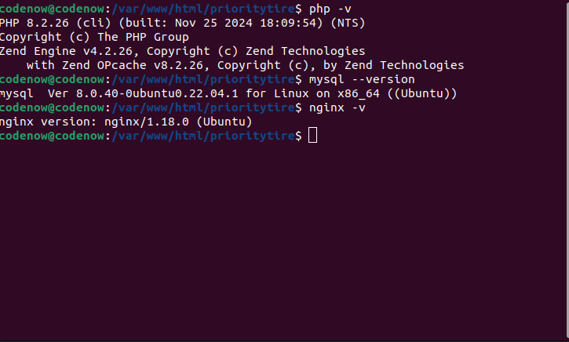
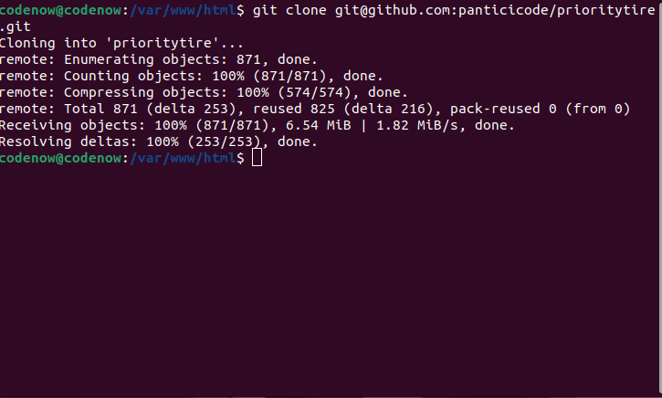
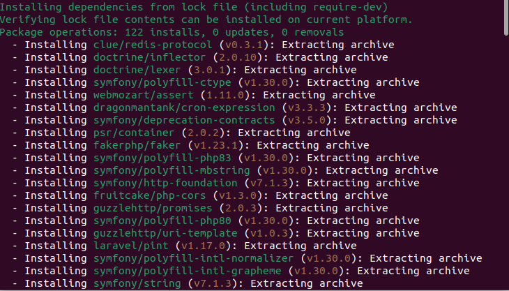
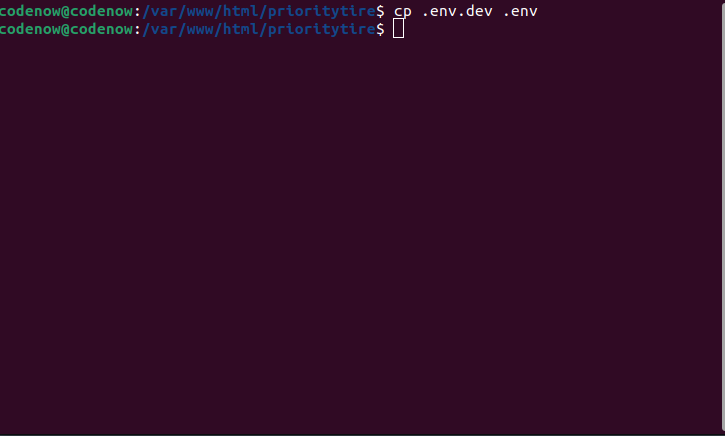
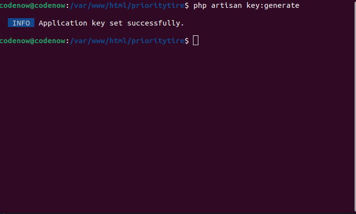
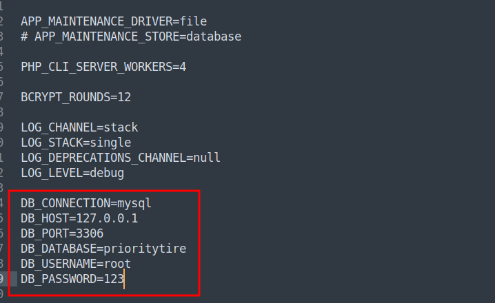
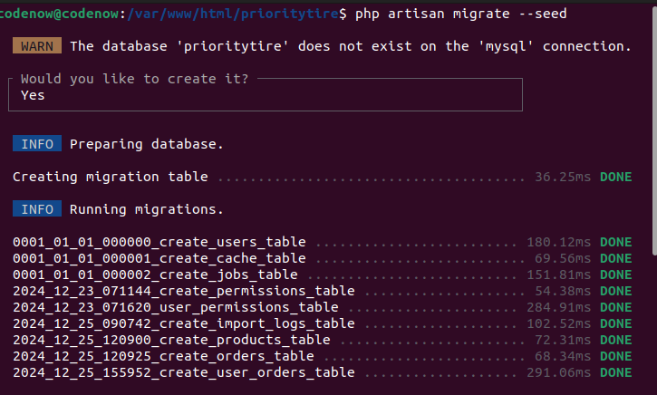
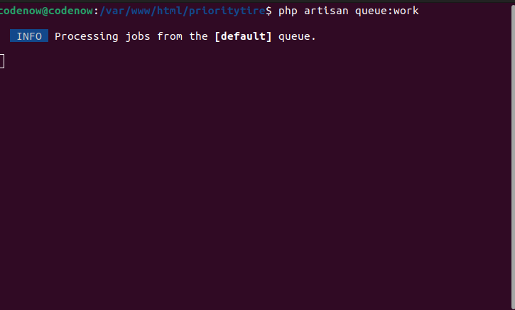
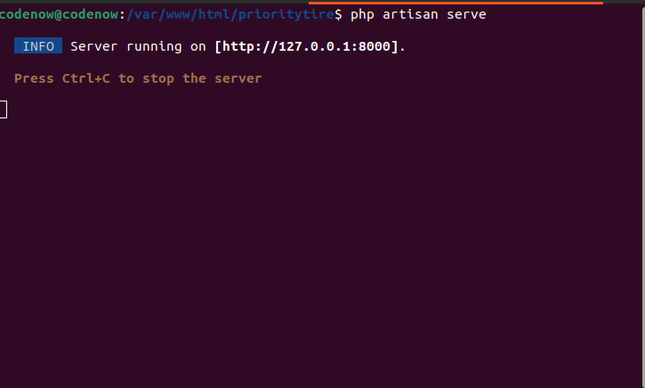
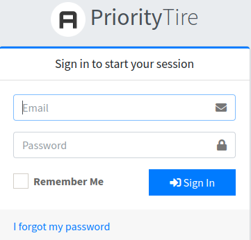

# PriorityTire Setup with Jobs Events & Listeners

This guide will show you how to set up and run this mini project build with Laravel.

### Prerequisites

- For **Linux**, you need to have Apache or Nginx installed along with PHP.
- For **Windows**, you need to have WAMP installed, which comes with Apache, PHP, and MySQL.

- PHP 8.1+
- MySQL 8+
- Web Server (Apache2, Nginx, or any other web server)



### Basic Setup

## Step 1: Clone the Repository

Navigate to the directory where you want to clone the repository:

```bash
cd /var/www/html/
```

then, clone the repository using one of the following methods:

### Using HTTPS:
```bash
git clone https://github.com/panticicode/prioritytire.git
```

### Using SSH (if set up):

```bash 
git clone git@github.com:panticicode/prioritytire.git
```



### Alternatively:

You can download the repository as a ZIP file from GitHub, extract it, and place it in your web server directory.

### Step 2: Place the Files

```bash
Linux: Move the files to /var/www/html/prioritytire/
Windows: Extract or move the files to C:\wamp64\www\prioritytire\.
```

### Step 3: Access the File

```bash 
- **Linux**: `/var/www/html/prioritytire/*`
- **Windows**: `C:\wamp64\www\prioritytire\*`
```

## Step 2: Install Dependencies

Navigate to the cloned directory and install the required dependencies using Composer:

```bash
cd prioritytire
composer install
```



### Step 3: Configure the Environment

1. Make a copy of environment file

```bash
cp .env.dev .env
```



2. Generate an application key:
```bash
php artisan key:generate
```



3. Edit the .env file to configure your database and other settings as needed. 



### Step 4: Set Up the Database

Run the following commands to migrate your database and run seeders:

```bash
php artisan migrate --seed
```
During migration it will ask for create new database choose yes if db not exist



4. Add Privileges

```bash
sudo chown -R www-data:www-data /var/www/html/prioritytire
sudo chmod -R 777 /var/www/html/prioritytire/storage
sudo chmod -R 777 /var/www/html/prioritytire/bootstrap
```

Note:
- chmod 777 grants full read, write, and execute permissions to all users. While this is acceptable for local development environments, it is not secure for production.

- For production, use more restrictive permissions (e.g., chmod 755 or chmod 775) and ensure sensitive files are owned by the web server user (www-data in this case).

### Running Jobs & Queues in the Background

To start the process in the background, follow these steps:

open your terminal and run

```sh
php artisan queue:work
```




### Running the Application with php artisan serve

Laravel comes with a built-in development server, which you can use for quick testing and development. Here’s how to use it:

Assuming we already running our queue background process, In a separate terminal, run:

```bash
php artisan serve
```


### Access the Application

- Access your application at http://localhost:8000

Notes: If port 8000 is already in use, you can specify a different port using the --port option:

```bash
php artisan serve --port=8080
```

## Environment Configuration

Ensure your .env file is correctly configured for your local development environment. Key settings include:

- Database connection settings
- Pusher configuration
- Queue connection settings

If everything is set up correctly, you can access your application at:

[http://localhost:8000](http://localhost:8000)


## Users

| Default User              | Password |
|---------------------------|----------|
| admin@prioritytire.local  |   123    |



Development Only: Note that php artisan serve is intended for development purposes only. For production, it's recommended to use a proper web server like Apache or Nginx.


## Advanced Setup

### Running the Application on Linux

### Apache Setup

- Install Apache and PHP: If Apache and PHP are not installed yet, run:

```bash
sudo apt update
sudo apt install apache2 php libapache2-mod-php php-xml php-mbstring
```

- Set up your application: Place your application in /var/www/html/prioritytire/.
- Set permissions:

```bash
sudo chown -R www-data:www-data /var/www/html/prioritytire
sudo chmod -R 755 /var/www/html/prioritytire/storage
```
- Restart Apache:

```bash
sudo service apache2 restart
```

### Nginx Setup

```bash
sudo apt update
sudo apt install nginx php-fpm
```

- Configure Host: Edit your host file:

```bash
sudo nano /etc/hosts
```
with this line

```bash
127.0.0.1 prioritytire.local
```

- save the file

- Configure Nginx: Create the Nginx configuration file (e.g., /etc/nginx/sites-available/prioritytire) to include:

```bash
sudo nano /etc/nginx/sites-available/prioritytire
```

and paste following code 

```bash
server {
    listen 80;
    server_name prioritytire.local www.prioritytire.local;

    root /var/www/html/prioritytire/public;
    index index.html index.htm index.php;

    location / {
        try_files $uri $uri/ /index.php?$query_string;
    }

    location ~ \.php$ {
        include snippets/fastcgi-php.conf;
        fastcgi_pass unix:/var/run/php/php8.2-fpm.sock;  # Change PHP version if necessary
        fastcgi_param SCRIPT_FILENAME $document_root$fastcgi_script_name;
        include fastcgi_params;
    }

    location ~ /\.ht {
        deny all;
    }
}
```

- save the file

### Set permissions:

```bash
sudo chown -R www-data:www-data /var/www/html/prioritytire
sudo chmod -R 755 /var/www/html/prioritytire/storage
```

### Restart Nginx

```bash
sudo systemctl restart nginx
```

### Running the Application on Windows

- Install WAMP: Download and install WAMP from [here](https://sourceforge.net/projects/wampserver).
- Place your application: Move your application to C:\wamp64\www\prioritytire\
- Start WAMP: Launch WAMP, and ensure the server is running (look for a green icon in the system tray).
- Access the application: Open your browser and navigate to:


### Access the Application

- Access your application at http://prioritytire.local

### Troubleshooting

## Linux

- 403 Forbidden Error: Ensure that permissions are correct:

```bash
sudo chown -R www-data:www-data /var/www/html/prioritytire
sudo chmod -R 755 /var/www/html/prioritytire/storage
```

- Apache Not Serving PHP: Ensure PHP is installed and restart Apache.
- Nginx Not Serving PHP: Ensure that the PHP-FPM service is running and the socket path in the Nginx configuration is correct.

## Windows

- WAMP Not Running: Make sure WAMP is started and check the icon in the system tray. If it's not green, check for port conflicts (usually with port 80).

### Conclusion

Follow the appropriate steps for your operating system to run the minimal Laravel application. If you encounter issues, check the permissions, configuration files, and ensure the necessary services are running.
